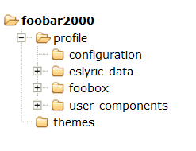
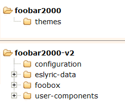
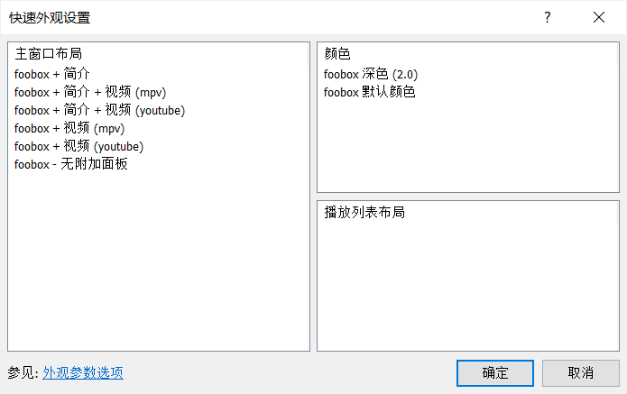
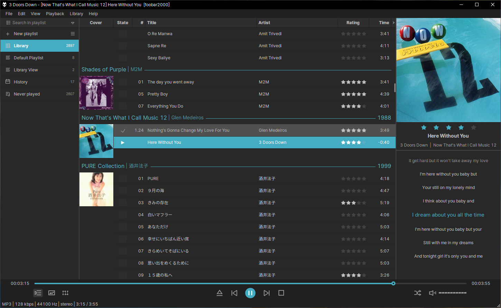

# foobox
foobox 是一个 [foobar2000](https://www.foobar2000.org) 默认用户界面 (DUI) 的皮肤配置，基于 jsplitter (Spider Monkey Panel 版) 组件，符合主流软件的审美，扩展功能丰富并保持软件的流畅运行.
## 【制作和使用】
foobox 中文版适用于 foobar2000 汉化版 by [Asion](https://www.cnblogs.com/asionwu) 或[智享阁](https://www.esnpc.com/)，使用以下第三方组件:  
* ttsping 的歌词组件 [ESLyric](https://github.com/ESLyric/release);  
* 基于 [Spider Monkey Panel](https://github.com/TheQwertiest/foo_spider_monkey_panel) 的 [JSplitter](https://foobar2000.ru/forum/viewtopic.php?t=6378);  
* [foo_enhanced_spectrum_analyzer](https://hydrogenaud.io/index.php/topic,116014.0.html).

并修改使用以下优秀的代码部件:  
* 播放列表管理器，播放列表，封面浏览原作者 br3tt，汉化 always_beta;  
* 封面面板原作者 Jensen;  
* 搜索框原作者 [Asion](https://www.cnblogs.com/asionwu);  
* [简介面板](https://github.com/Wil-B/Biography)作者 Wil-B;
* 网络电台列表维护 [范明明](https://github.com/fanmingming);

**到最新 Releases (发行版) 页面下载安装包，从 7.24 起，安装包不再集成 foobar2000 汉化版，仅包含 foobox 主题及所需组件，绿色安装，自由便捷。**  
> **Note** 由于所依赖的组件 JSplitter 目前只有 32 位，故暂不支持 foobar2000 x64 版本  

额外的视频面板可选安装，它基于 [foo-youtube](https://fy.3dyd.com/download/) 和 [foo_input_ffmpeg](https://www.foobar2000.org/components/view/foo_input_ffmpeg) 组件。  
<!-- * 感谢[南陇居士](https://www.nljs.site/)制作的整合安装包: [https://www.nljs.site/foobar2000.html](https://www.nljs.site/foobar2000.html)
> **Note** 。\
>安装版基于 foobar2000 [智享阁Yeyo 汉化版 2.x]

## 【用主题包手动安装】
> **Note** 由于所依赖的组件 JSplitter 目前只有 32 位，故暂不支持 foobar2000 x64 版本。

1. 下载和安装 foobar2000 汉化版：
* [智享阁Yeyo 汉化版 2.x](https://www.esnpc.com/foobar2000-20-simplified-chinese-version/)，下载 32 位的，或
* [Asion 汉化版 1.6.16 版](https://www.cnblogs.com/asionwu)，注意不要使用 Plus 版，它只集成至 foobox 7.8。

2. 下载最新的非整合安装包的主题 Release 包，解压后：
* 复制 themes 文件夹到已有的 foobar2000 中文汉化版目录下;
* 复制 profile 里的文件夹到 foobar2000 用户配置目录下;
* 简介面板 (作者 Wil-B) 需要 [fontawesome-webfont.ttf](https://ghproxy.com/https://github.com/beakerbrowser/beakerbrowser.com/raw/master/fonts/fontawesome-webfont.ttf) 字体，请复制到 C:\Windows\Fonts 目录下. 简介面板的完整功能需要连接外网，请自行解决 (如不想用也可以选择无简介面板的布局).

> **Note** 便携版，profile 位于 foobar2000 根目录下。目录结构如下:

> **Note** 非便携版，即各用户使用独立配置文件，用户配置文件夹位于：\
> **C:\Users\用户名\AppData\Roaming\foobar2000**  (1.x版)\
> **C:\Users\用户名\AppData\Roaming\foobar2000-v2**  (2.x版)\
> 目录结构如下 (2.x版为例):

## 【额外的视频面板整合】
从 foobox 7.16 版开始支持整合 foo-youtube 以及 foo-mpv 视频面板到主界面。标准的 release 包没有视频面板组件和主题文件，如需要该功能可下载视频面板整合包 ([github](https://github.com/dream7180/foobox-cn/releases/tag/video) | [gitee](https://gitee.com/dream7180/foobox-cn/releases/tag/video))，解压后按上面类似的方法安装。完成后可以在 “主菜单--视图--布局--快速设置”里切换各种 foobox 布局组合。
-->
完成后可以在 “主菜单--视图--布局--快速设置”里切换各种 foobox 布局组合。  

[**查看 foobox 帮助**](https://dream7180.gitee.io/2023/foobox-release/)

