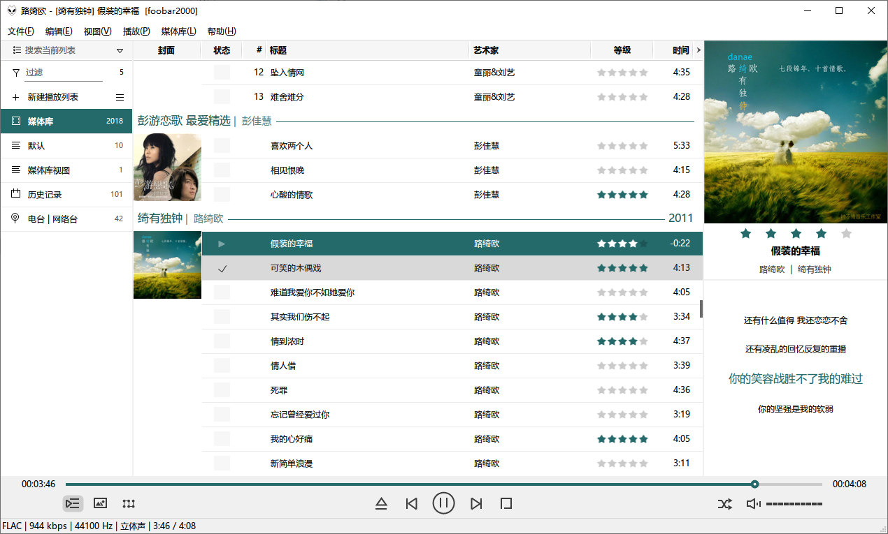

# foobox

foobox 是一个 foobar2000 默认用户界面 (DUI) 的皮肤配置，具有简洁而美观实用的特点，善于管理曲目数量大的媒体库 ，对音乐各种封面提供丰富的支持。   
-----------------------------------\
【安装】\
你可以到 https://www.cnblogs.com/asionwu 下载集成了foobox 的 foobar2000 汉化 plus 版。\
也可以下载 release 包直接复制到已有的 foobar2000 目录下。

